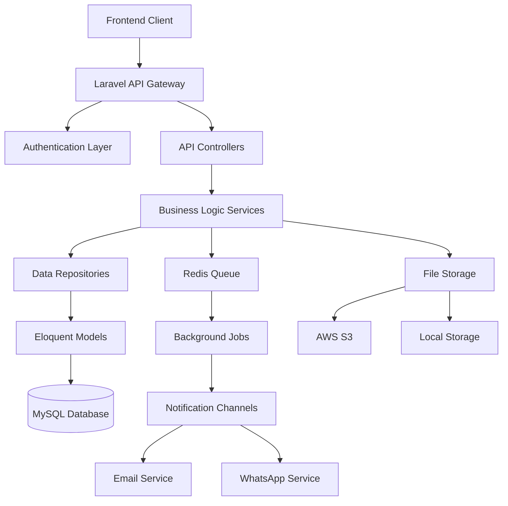
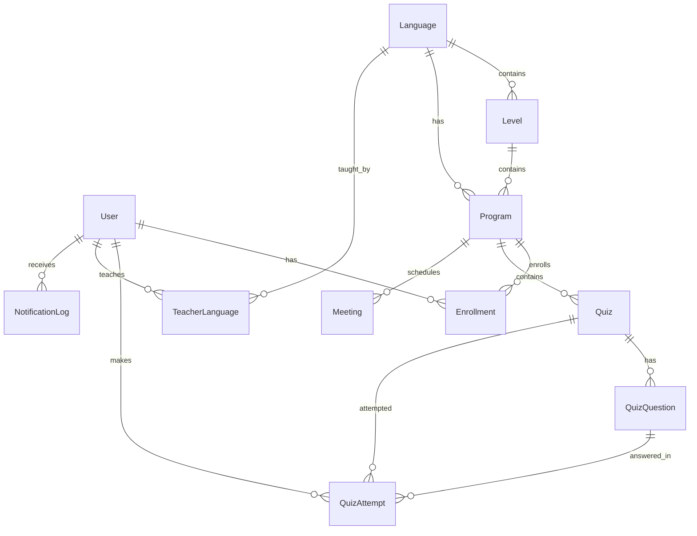

# Design Document

## Overview

The Learn Academy backend is designed as a RESTful API using Laravel 12 with a clean architecture approach. The system follows Domain-Driven Design principles with clear separation of concerns between authentication, user management, content management, and notification systems. The architecture supports multi-tenancy through role-based access control and provides flexible guest access controls.

## Architecture

### High-Level Architecture



### Core Layers

1. **API Layer**: RESTful endpoints with proper HTTP status codes and JSON responses
2. **Authentication Layer**: Laravel Sanctum for API token management
3. **Authorization Layer**: Spatie Laravel Permission for role-based access control
4. **Business Logic Layer**: Service classes handling complex business rules
5. **Data Access Layer**: Repository pattern with Eloquent models
6. **Queue Layer**: Redis-backed queues with Horizon for job monitoring
7. **Storage Layer**: Laravel Filesystem abstraction for file management
8. **Notification Layer**: Multi-channel notification system

## Components and Interfaces

### Authentication System

**Components:**

- `AuthController`: Handles registration, login, logout
- `AuthService`: Business logic for user authentication
- `UserRepository`: Data access for user operations
- `SanctumTokenService`: Token management and validation

**Key Interfaces:**

```php
interface AuthServiceInterface
{
    public function register(array $userData): User;
    public function login(array $credentials): string; // Returns token
    public function logout(User $user): bool;
}

interface UserRepositoryInterface
{
    public function create(array $data): User;
    public function findByEmail(string $email): ?User;
    public function assignToPrograms(User $user, Collection $programs): void;
}
```

### Program Management System

**Components:**

- `ProgramController`: CRUD operations for programs
- `ProgramService`: Business logic for program enrollment and management
- `EnrollmentService`: Handles student-program relationships
- `AccessControlService`: Manages admin approval for student access

**Key Interfaces:**

```php
interface ProgramServiceInterface
{
    public function createProgram(array $data): Program;
    public function enrollStudent(User $student, Program $program): Enrollment;
    public function grantAccess(Enrollment $enrollment): void;
}

interface AccessControlServiceInterface
{
    public function canStudentAccess(User $student, Program $program): bool;
    public function grantProgramAccess(User $student, Program $program): void;
}
```

### Quiz Management System

**Components:**

- `QuizController`: Quiz CRUD and attempt handling
- `QuizService`: Business logic for quiz creation and scoring
- `QuizAttemptService`: Handles quiz attempts and scoring
- `FileUploadService`: Manages quiz file uploads

**Key Interfaces:**

```php
interface QuizServiceInterface
{
    public function createQuiz(array $data, ?UploadedFile $file): Quiz;
    public function addQuestion(Quiz $quiz, array $questionData): QuizQuestion;
}

interface QuizAttemptServiceInterface
{
    public function submitAttempt(Quiz $quiz, ?User $student, array $answers): QuizAttempt;
    public function calculateScore(Quiz $quiz, array $answers): int;
}
```

### Meeting Management System

**Components:**

- `MeetingController`: Meeting scheduling and management
- `MeetingService`: Business logic for meeting creation
- `MeetingNotificationService`: Handles meeting notifications

### Teacher Management System

**Components:**

- `TeacherController`: Teacher profile and assignment management
- `TeacherService`: Business logic for teacher operations
- `ImageUploadService`: Handles teacher profile image uploads
- `TeacherLanguageService`: Manages teacher-language associations

### Guest Access System

**Components:**

- `GuestAccessMiddleware`: Validates guest access permissions
- `SettingsService`: Manages system settings for guest access
- `GuestController`: Handles guest-accessible endpoints

### Notification System

**Components:**

- `NotificationService`: Orchestrates multi-channel notifications
- `EmailNotificationChannel`: Email notification implementation
- `WhatsAppNotificationChannel`: WhatsApp notification implementation
- `NotificationLogger`: Logs all notification attempts

### Translation System

**Components:**

- `TranslationController`: Serves translation data
- `TranslationService`: Manages translation loading and caching
- `LocaleMiddleware`: Handles locale detection and setting

## Data Models

### Core Models and Relationships



### Model Specifications

**User Model:**

- Implements `HasRoles` trait from Spatie Permission
- Uses `HasApiTokens` trait from Sanctum
- Soft deletes enabled
- Encrypted sensitive fields (phone)

**Program Model:**

- Composite relationships with Language and Level
- Enrollment tracking with timestamps
- Access control flags

**Quiz Model:**

- Polymorphic file storage support
- JSON casting for inline questions
- Scoring configuration

**Enrollment Model:**

- Pivot model with additional fields
- Access approval tracking
- Timestamp tracking for enrollment and access grant

## Error Handling

### Exception Hierarchy

```php
abstract class LearnAcademyException extends Exception {}

class AuthenticationException extends LearnAcademyException {}
class AuthorizationException extends LearnAcademyException {}
class ValidationException extends LearnAcademyException {}
class ResourceNotFoundException extends LearnAcademyException {}
class AccessDeniedException extends LearnAcademyException {}
class FileUploadException extends LearnAcademyException {}
class NotificationException extends LearnAcademyException {}
```

### Error Response Format

```json
{
  "success": false,
  "error": {
    "code": "RESOURCE_NOT_FOUND",
    "message": "The requested quiz was not found",
    "details": {
      "quiz_id": 123
    }
  },
  "timestamp": "2025-01-15T10:30:00Z"
}
```

### Global Exception Handler

- Custom exception handler extending Laravel's default
- Consistent JSON error responses
- Logging integration with context
- Rate limiting for error responses

## Testing Strategy

### Unit Testing

**Coverage Areas:**

- Service layer business logic
- Model relationships and scopes
- Validation rules and custom validators
- Helper functions and utilities

**Testing Approach:**

- PHPUnit with Laravel's testing utilities
- Mock external dependencies (storage, notifications)
- Database transactions for test isolation
- Factory-based test data generation

### Integration Testing

**API Endpoint Testing:**

- Feature tests for all API endpoints
- Authentication and authorization testing
- File upload testing with temporary storage
- Queue job testing with fake drivers

**Database Testing:**

- Migration testing
- Seeder validation
- Relationship integrity testing
- Performance testing for complex queries

### End-to-End Testing

**User Journey Testing:**

- Complete registration and enrollment flow
- Quiz creation and attempt workflow
- Meeting scheduling and notification flow
- Admin approval and access control flow

**Guest Access Testing:**

- Guest endpoint accessibility based on settings
- Anonymous quiz attempt functionality
- Public teacher and language visibility

### Performance Testing

**Load Testing:**

- API endpoint performance under load
- Database query optimization validation
- File upload performance testing
- Queue processing performance

**Caching Strategy Testing:**

- Translation caching effectiveness
- Model caching for frequently accessed data
- API response caching for guest endpoints

### Security Testing

**Authentication Testing:**

- Token validation and expiration
- Password security and hashing
- Rate limiting effectiveness

**Authorization Testing:**

- Role-based access control validation
- Guest access restriction enforcement
- Data isolation between users

**Input Validation Testing:**

- SQL injection prevention
- XSS prevention in JSON responses
- File upload security validation

### Notification Testing

**Channel Testing:**

- Email delivery testing with mail traps
- WhatsApp integration testing with test numbers
- Notification preference respect testing

**Queue Testing:**

- Job processing reliability
- Failed job handling
- Queue performance under load

### Deployment Testing

**Environment Testing:**

- Configuration validation across environments
- Database migration testing
- File storage accessibility testing
- External service connectivity testing
